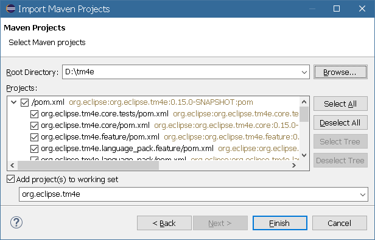

# Contributing to Eclipse TM4E

Welcome to the Eclipse TM4E contributor land, and thanks in advance for your help in making Eclipse TM4E better and better!

🏠 The official Eclipse TM4E Git repository is https://github.com/eclipse-tm4e/tm4e.


## ⚖️ Legal and Eclipse Foundation terms

The project license is available at [LICENSE](LICENSE).

This Eclipse Foundation open project is governed by the Eclipse Foundation Development Process and operates under the terms of
the Eclipse IP Policy.

Before your contribution can be accepted by the project team, contributors must have an Eclipse Foundation account and must
electronically sign the Eclipse Contributor Agreement (ECA):
- http://www.eclipse.org/legal/ECA.php

For more information, please see the Eclipse Committer Handbook: https://www.eclipse.org/projects/handbook/#resources-commit.


## 💬 Get in touch with the community

Eclipse TM4E use mainly 2 channels for strategical and technical discussions

- 🐞 View and report issues through uses GitHub Issues at https://github.com/eclipse/m2e-tm4e/issues.
- 📧 Join the tm4e-dev@eclipse.org mailing-list to get in touch with other contributors about project organization and planning,
  and browse archive at 📜 https://accounts.eclipse.org/mailing-list/tm4e-dev


## 🆕 Trying latest builds

Latest builds, for testing, can be found at https://download.eclipse.org/tm4e/snapshots/.


## 🧑‍💻 Developer resources

### ⌨️ Setting up the Development Environment manually

1. Download and install the **Eclipse IDE for Eclipse Committers** from https://www.eclipse.org/downloads/packages/ or another
   Eclipse installation with the [Plug-in Development Environment (PDE)](https://www.eclipse.org/pde/) installed.
1. Clone this repository <a href="https://mickaelistria.github.io/redirctToEclipseIDECloneCommand/redirect.html"></a>.
1. _File > Import > Existing Maven Project_, select the path to the TM4E Git repository and import projects and all modules
   
1. To solve the compiler errors, open the [target-platforms/oldest.target](target-platforms/oldest.target) file in Eclipse, wait until all dependencies are resolved, and click on _**Set as Active Target Platform**_
   

### 🏗️ Build & Test

1. **On command line**

   On Windows execute `mvnw clean verify`\
   On Linux execute `./mvnw clean verify`

2. **Within Eclipse**

   - To run full Maven builds: Having [M2E](https://www.eclipse.org/m2e/) installed, right-click on the tm4e root folder > _Run As > Maven build_

   - To run the non-UI tests of any imported module, right-click on the respective project and select > _RunAs > JUnit Test_

   - To run the UI tests, right-click on the `org.eclipse.tm4e.ui.tests` project and select > _RunAs > JUnit Plug-in Test_

3. **Running the CI job locally:**

    TM4E's [GitHub Actions wokflow](.github/workflows/build.yml) is compatible with [nektos/act](https://github.com/nektos/act) a
    command-line tool that allows you to run GitHub Actions workflows locally.

    1. Install Docker
    1. Install [nektos/act](https://github.com/nektos/act)
    1. From the command line navigate into the tm4e project root
    1. Run the command `act`
    1. On subsequent re-runs you can use `act -r` to reuse previous container which avoids re-installation system packages and
       reduces build times.

    In case of build failures the docker container will still be running and you can SSH into it for analysis
    using `docker exec -u root -it <CONTAINER_ID> /bin/bash`, e.g.:
    ```bash
    container_id=$(docker container ps --filter status=running --filter name=act-Build-build --format {{.ID}})
    docker exec -u root -it $container_id /bin/bash
    ```

### ⬆️ Version bump

The TM4E project adopts [Semantic Versioning](https://semver.org/) on release level, ensuring the proper exposure of API contracts
and addressing potential breakages.

To alleviate confusion among end-users regarding the effectively installed TM4E release and to ease the development process and
troubleshooting, starting with version **0.9.0**, individual TM4E features/plugins are no longer versioned independently
(OSGi semantic versioning). Instead, they are aligned with the overall TM4E release version, following a practice that is common
in other Eclipse Platform projects, such as EGit, Mylyn, or Xtext, as well as popular projects outside the Eclipse Platform
universe, like the Spring Application Framework or Quarkus.

In this versioning approach, when any plugin introduces new features necessitating a minor version increment, the versions of
**all** TM4E plugins/features are updated collectively, and the next release version will be adjusted accordingly.

To simplify version increments, utilize the `bump-versions.py` Python script located in the root project directory. This script
facilitates the recursive update of the project version and plugin dependencies in all relevant files, including `pom.xml`,
`feature.xml`, and `META-INF/MANIFEST.MF`.

The usage is as follows:
```bash
$ python bump-version.py (major|minor|micro)
```

Where
- `micro` (`+0.0.1`) is for a backward compatible bugfix, or an internal change that doesn't surface to APIs
- `minor` (`+0.1.0`) is for a backward compatible API or feature addition
- `major` (`+1.0.0`) is for an API breakage (needs to be discussed on the mailing-list first)

### ➕ Submit changes

TM4E only accepts contributions via GitHub Pull Requests against https://github.com/eclipse-tm4e/tm4e repository.

Before sending us a pull request, please ensure that:

1. You are working against the latest source on the **main** branch.
1. You check existing open and recently merged pull requests to make sure someone else hasn't already addressed the issue.

To send us a pull request, please:

1. Fork the repository.
1. Modify the source while focusing on the specific change you are contributing.
1. Commit to your fork using clear, descriptive [semantic commit messages](https://www.conventionalcommits.org/en/).
1. Send us a pull request, answering any default questions in the pull request interface.

GitHub provides additional documentation on [forking a repository](https://help.github.com/articles/fork-a-repo/) and
[creating a pull request](https://help.github.com/articles/creating-a-pull-request/)

### Release

1. Decide of a version name, we'll call it `x.y.z` here. Ensure all plugins have this version set in their MANIFEST.MF.
   You can use the `bump-versions.py` Python script to set the version as needed.
1. Get the main code locally, e.g.: `git fetch eclipse main && git checkout FETCH_HEAD`
1. Tag it `git tag x.y.x`
1. Push tag, e.g. `git push eclipse x.y.z`
1. Re-run a build from https://ci.eclipse.org/tm4e/job/TM4E/job/main/ and ensure it passes
1. Upon completion of the build, run https://ci.eclipse.org/tm4e/job/promote-snapshot-to-release/ with version `x.y.z`
1. Create a new `x.y.z` release entry on GitHub, from the `x.y.z` tag.
1. Create a new `x.y.z` release entry on https://projects.eclipse.org/projects/technology.tm4e
1. Create a PR to update https://github.com/eclipse-simrel/simrel.build/blob/main/tm4e.aggrcon
   - For SimRel release dates see https://github.com/eclipse-simrel/.github/blob/main/wiki/Simultaneous_Release.md
1. (Optionally) Announce on mailing-lists. social media...
1. Run `python bump-version.py patch` and commit all changed pom.xml/feature.xml/MANIFEST.MF files to `main` branch
