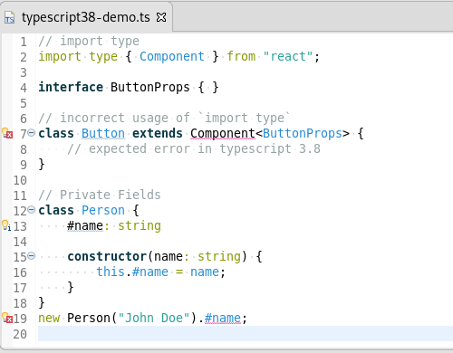

# Eclipse TM4E - TextMate grammars and language configuration for the Eclipse IDE

[](https://github.com/eclipse-tm4e/tm4e/actions/workflows/build.yml)
[](https://ci.eclipse.org/tm4e/job/TM4E/)
[](LICENSE)


## Table of contents

- [About TM4E](#about-tm4e)
- [Key Features](#key-features)
- [Installation](#-installation)
- [Getting started as an end user](#-getting-started-as-an-end-user)
- [Who is using TM4E?](#-who-is-using-tm4e)
- [Architecture and modules](#-architecture-and-modules)
- [Integrating TM4E](#-integrating-tm4e)
- [Contributing](#-contributing)
- [License](#-license)


## About TM4E

TM4E provides a Java implementation of the [TextMate grammar](https://en.wikipedia.org/wiki/TextMate#Language_grammars) engine, based on the [microsoft/vscode-textmate](https://github.com/microsoft/vscode-textmate) project.
It can be embedded in any Java application, along with Eclipse IDE integration for syntax highlighting and VS Code-style [Language Configuration](https://code.visualstudio.com/api/references/contribution-points#contributes.languages) (brackets, auto-closing, on-enter behavior, and more).

**Example**: TypeScript editor using TM4E-based highlighting (from [Eclipse Wild Web Developer](https://github.com/eclipse/wildwebdeveloper))



TM4E is an [official Eclipse.org project](https://projects.eclipse.org/projects/technology.tm4e), and follows the usual Eclipse.org processes and IP requirements.


## Key features

- TextMate-based syntax highlighting for Eclipse editors, including the Generic Editor and TM4E-powered custom editors.
- Language-configuration based editor features, such as auto-closing and matching brackets, on-enter indentation and comment continuation, toggle line and block comments, and folding when supported.
- Themable colorization through TextMate themes, with built-in Light/Dark themes and additional themes contributed by plugins.
- A TM4E secondary partitioner that understands embedded languages and exposes normalized grammar scopes that other tooling can consume.


## 📥 Installation

### 1) In Eclipse IDE or RCP applications

You can install the latest stable TM4E release from the update site https://download.eclipse.org/tm4e/releases/latest/.
TM4E is usually installed together with its consumers, so end users should normally not need to install it directly.

The latest snapshot build can be installed from the update site https://download.eclipse.org/tm4e/snapshots/.

#### Eclipse IDE and Java compatibility

TM4E version |Min. Eclipse version | Min. Java version
-------------|---------------------|---------------------
[latest](https://download.eclipse.org/tm4e/releases/latest/)  | [2024-06](https://projects.eclipse.org/releases/2024-06) ([4.32](https://projects.eclipse.org/projects/eclipse/releases/4.32.0)) | 21
[0.16.0](https://download.eclipse.org/tm4e/releases/0.16.0/)+ | [2024-06](https://projects.eclipse.org/releases/2024-06) ([4.32](https://projects.eclipse.org/projects/eclipse/releases/4.32.0)) | 21
[0.9.0](https://download.eclipse.org/tm4e/releases/0.9.0/)+   | [2023-09](https://projects.eclipse.org/releases/2023-09) ([4.29](https://projects.eclipse.org/projects/eclipse/releases/4.29.0)) | 17
[0.8.1](https://download.eclipse.org/tm4e/releases/0.8.1/)+   | [2023-06](https://projects.eclipse.org/releases/2023-06) ([4.28](https://projects.eclipse.org/projects/eclipse/releases/4.28.0)) | 17
[0.8](https://download.eclipse.org/tm4e/releases/0.8/)+       | [2023-03](https://projects.eclipse.org/releases/2023-03) ([4.27](https://projects.eclipse.org/projects/eclipse/releases/4.27.0)) | 17
[0.6.3](https://download.eclipse.org/tm4e/releases/0.6.3/)+   | [2022-12](https://projects.eclipse.org/releases/2022-12) ([4.26](https://projects.eclipse.org/projects/eclipse/releases/4.26.0)) | 17
[0.6.2](https://download.eclipse.org/tm4e/releases/0.6.2/)+   | [2022-09](https://projects.eclipse.org/releases/2022-09) ([4.25](https://projects.eclipse.org/projects/eclipse/releases/4.25.0)) | 17
[0.6.0](https://download.eclipse.org/tm4e/releases/0.6.0/)+   | [2022-03](https://projects.eclipse.org/releases/2022-03) ([4.23](https://projects.eclipse.org/projects/eclipse/releases/4.23.0)) | 17

### 2) As a Java API with Maven

**Snapshot** binaries of `org.eclipse.tm4e.core` are available at https://repo.eclipse.org/content/repositories/tm4e-snapshots/org/eclipse/org.eclipse.tm4e.core/.
You need to add the following repository configuration to your Maven `settings.xml`:

```xml
<?xml version="1.0" encoding="UTF-8" ?>
<settings>
  <profiles>
    <profile>
      <repositories>
        <repository>
          <id>tm4e-snapshots</id>
          <name>tm4e-snapshots</name>
          <url>https://repo.eclipse.org/content/repositories/tm4e-snapshots/</url>
          <releases><enabled>false</enabled></releases>
          <snapshots><enabled>true</enabled></snapshots>
        </repository>
      </repositories>
    </profile>
  </profiles>
  <activeProfiles>
    <activeProfile>tm4e-snapshots</activeProfile>
  </activeProfiles>
</settings>
```

Then reference the dependency in your pom.xml as follows:
```xml
<dependencies>
  <dependency>
    <groupId>org.eclipse</groupId>
    <artifactId>org.eclipse.tm4e.core</artifactId>
    <version>[VERSION]-SNAPSHOT</version>
  </dependency>
</dependencies>
```


## 🚀 Getting started as an end user

If you are using an Eclipse IDE or other tool that ships TM4E-powered editors, you usually do not install TM4E directly.

- For day-to-day usage, configuration, and troubleshooting of TM4E-powered editors, see the [User Guide](docs/user-guide.md).
- For usage questions and general help, use [GitHub discussions](https://github.com/eclipse-tm4e/tm4e/discussions).
- To report problems with TM4E-powered editors, file issues in [GitHub issues](https://github.com/eclipse-tm4e/tm4e/issues) and include details about your IDE, TM4E version, and steps to reproduce.


## 🙋 Who is using TM4E?

Here are some projects that use TM4E:

- [Apache NetBeans](https://github.com/apache/netbeans) - A multi-language IDE using TM4E core parts to support syntax highlighting based on TextMate grammars.
- [Eclipse Corrosion](https://github.com/eclipse/corrosion) - Rust development tools in Eclipse IDE.
- [Eclipse aCute](https://github.com/eclipse/aCute) - C# edition in Eclipse IDE.
- [Eclipse Wild Web Developer](https://github.com/eclipse/wildwebdeveloper) - Modern, productive web development tools for the Eclipse IDE ([React](https://react.dev/), [Vue.js](https://vuejs.org/), [Astro](https://astro.build/), ...).
- [Eclipse ShellWax](https://github.com/eclipse/shellwax) - Shell scripting support for the Eclipse IDE, providing a rich editing experience through integration with the [Bash Language Server](https://github.com/bash-lsp/bash-language-server).
- [LiClipseText](https://www.liclipse.com/text/) - An editor which enables Eclipse to be used as a general-purpose text editor, providing support for multiple languages out of the box.
- [EditorConfig for Eclipse](https://github.com/angelozerr/ec4e) - [EditorConfig](https://editorconfig.org/) for Eclipse with GenericEditor.
- [Solargraph](https://github.com/PyvesB/eclipse-solargraph) - [Ruby](https://www.ruby-lang.org/) development tools for Eclipse.
- [dart4e](https://github.com/dart4e/dart4e) - [Dart](https://dart.dev/)/[Flutter](https://flutter.dev/) development support for the Eclipse IDE.
- [haxe4e](https://github.com/haxe4e/haxe4e) - [Haxe](https://haxe.org/) programming language support for the Eclipse IDE.
- [Previewer](https://github.com/sebthom/previewer-eclipse-plugin) - Eclipse plugin that contributes a Preview view that renders syntax-highlighted sample text in real-time using your TextMate grammar as you edit.
- Deprecated projects:
  - [BEF: Bazel Eclipse Feature](https://github.com/salesforce/bazel-eclipse/) - [Bazel](https://bazel.build/) support for the Eclipse IDE.
  - [Dartboard](https://github.com/eclipse/dartboard) - Dart language support for the Eclipse IDE.
  - [typescript.java](https://github.com/angelozerr/typescript.java) - TypeScript IDE for Eclipse with JSDT & tsserver.
  - [Phaser Editor 2D](https://github.com/PhaserEditor2D/PhaserEditor) - an IDE for the creation of HTML5 games.


## 🧩 Architecture and modules

TM4E is split into three main bundles plus an optional language pack feature:

- [org.eclipse.tm4e.core](https://github.com/eclipse-tm4e/tm4e/tree/main/org.eclipse.tm4e.core) - Java TextMate engine (a port of [vscode-textmate](https://github.com/Microsoft/vscode-textmate)), UI-agnostic and usable with any Java UI toolkit.
- [org.eclipse.tm4e.ui](https://github.com/eclipse-tm4e/tm4e/tree/main/org.eclipse.tm4e.ui) - Eclipse integration layer providing [`TMPresentationReconciler`](org.eclipse.tm4e.ui/src/main/java/org/eclipse/tm4e/ui/text/TMPresentationReconciler.java), TextMate-based partitioning, theming, preference pages, hovers, and diagnostics.
- [org.eclipse.tm4e.languageconfiguration](https://github.com/eclipse-tm4e/tm4e/tree/main/org.eclipse.tm4e.languageconfiguration) - VS Code-style `language-configuration.json` support for bracket handling, auto-close, on-enter behavior, and comment toggling.
- [org.eclipse.tm4e.language_pack](https://github.com/eclipse-tm4e/tm4e/tree/main/org.eclipse.tm4e.language_pack) - Optional language pack feature that bundles 50+ TextMate grammars and language configurations so many common languages work out of the box in the Eclipse IDE.


## 🔌 Integrating TM4E

If you are an Eclipse plug-in developer or Java tool author and want to integrate TM4E in your own tools:

- Start with the [Adopter Guide](docs/adopter-guide.md) for how to depend on TM4E, contribute grammars, themes, and language configurations, and wire TM4E into editors.
- For integration questions, best practices, and design discussions, use [GitHub discussions](https://github.com/eclipse-tm4e/tm4e/discussions).
- To report bugs or request new APIs or integration features, file issues in [GitHub issues](https://github.com/eclipse-tm4e/tm4e/issues).


## 🤝 Contributing

If you want to work on TM4E itself:

- Source code lives in this [github.com/eclipse-tm4e/tm4e](https://github.com/eclipse-tm4e/tm4e) repository.\
  <a href="https://mickaelistria.github.io/redirctToEclipseIDECloneCommand/redirect.html"></a>
- Quick Start: to build and test locally from the command line, run `./mvnw clean verify` (Linux/macOS) or `mvnw clean verify` (Windows).
- See the [Contributor Guide](docs/contributor-guide.md) for repository layout, development environment setup, **internal architecture** (registry, Generic Editor wiring, async tokenization, TM partitioner), diagnostics, semantic versioning, and the detailed release process.
- See [CONTRIBUTING.md](CONTRIBUTING.md) for prerequisites, legal terms, and the contribution workflow.
- For design discussions and contribution-related questions, use [GitHub discussions](https://github.com/eclipse-tm4e/tm4e/discussions).
- Contributors are encouraged to subscribe to the [tm4e-dev mailing list](https://dev.eclipse.org/mailman/listinfo/tm4e-dev).
- As with other Eclipse.org projects, active contributors who consistently uphold quality standards and good judgment may be nominated as committers.


## 🧾 License

TM4E is a community-driven open-source project licensed under the [Eclipse Public License 2.0](LICENSE).
