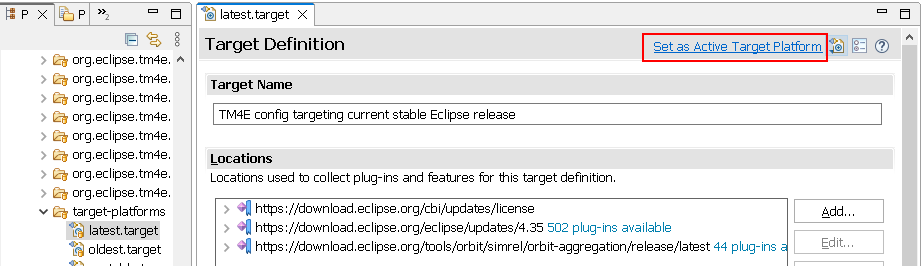
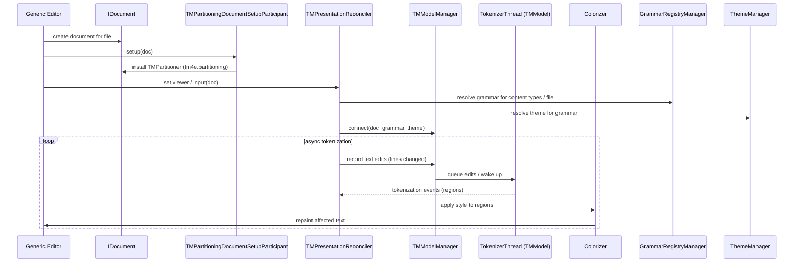

# TM4E Contributor Guide

This guide is for contributors and maintainers working on TM4E itself.
It explains how the repository is structured, how the core engine and registry behave, how the TM-specific partitioner works, and how to troubleshoot and evolve the code base.


## Table of contents

1. [Repository and Module Overview](#repository-and-module-overview)
1. [Development and Build Setup](#development-and-build-setup)
   1. [Setting up the Development Environment in Eclipse](#setting-up-the-development-environment-in-eclipse)
   1. [Local Build & Test](#local-build--test)
1. [Textmate Tokenization Engine](#textmate-tokenization-engine)
1. [Registry and Grammar Loading](#registry-and-grammar-loading)
1. [Language Configuration and Folding Internals](#language-configuration-and-folding-internals)
1. [Generic Editor Integration and Async Tokenization](#generic-editor-integration-and-async-tokenization)
1. [TM Partitioner (Secondary Partitioning)](#tm-partitioner-secondary-partitioning)
1. [Handling Conflicting Grammar Registrations](#handling-conflicting-grammar-registrations)
1. [Diagnostics and Troubleshooting for Contributors](#diagnostics-and-troubleshooting-for-contributors)
1. [Tracking Upstream vscode-textmate Changes](#tracking-upstream-vscode-textmate-changes)
1. [Extension and API Evolution Guidelines](#extension-and-api-evolution-guidelines)
1. [Release Process (Overview)](#release-process-overview)
1. [Eclipse Plug-in Development Resources](#eclipse-plug-in-development-resources)


## Repository and Module Overview

The TM4E repository is organized into a small set of key modules:

- **[org.eclipse.tm4e.core](../org.eclipse.tm4e.core)** contains the TextMate engine, a Java port of the [vscode-textmate](https://github.com/Microsoft/vscode-textmate/) tokenizer.
  It is UI-agnostic and can be used outside Eclipse in other Java applications.
  It exposes the familiar [`Registry`](../org.eclipse.tm4e.core/src/main/java/org/eclipse/tm4e/core/registry/Registry.java)/[`IGrammar`](../org.eclipse.tm4e.core/src/main/java/org/eclipse/tm4e/core/grammar/IGrammar.java) API for loading grammars and tokenizing lines into scoped tokens.

- **[org.eclipse.tm4e.registry](../org.eclipse.tm4e.registry)** builds on top of the core engine and provides the Eclipse-facing grammar registry.
  It processes extension points that contribute grammars, injections, and bindings between Eclipse content types and TextMate scopes, and owns the [`GrammarRegistryManager`](../org.eclipse.tm4e.registry/src/main/java/org/eclipse/tm4e/registry/internal/GrammarRegistryManager.java) implementation.

- **[org.eclipse.tm4e.languageconfiguration](../org.eclipse.tm4e.languageconfiguration)** parses VS Code style [language-configuration.json](https://code.visualstudio.com/api/language-extensions/language-configuration-guide) files
  and turns them into language-configuration based editor features such as bracket handling, on-enter indentation, and comment toggling.
  It is consumed by the UI bundle and by the preferences pages.

- **[org.eclipse.tm4e.ui](../org.eclipse.tm4e.ui)** integrates TM4E into Eclipse UI.
  It provides [`TMPresentationReconciler`](../org.eclipse.tm4e.ui/src/main/java/org/eclipse/tm4e/ui/text/TMPresentationReconciler.java) for syntax highlighting, installs the secondary TM partitioner, contributes TextMate-related preference pages, manages themes, and implements hovers and diagnostic tooling.

- **[org.eclipse.tm4e.samples](../org.eclipse.tm4e.samples)** contains sample grammars, themes, and editors that are useful when testing changes or when you need a concrete example of how extension points are used.


## Development and Build Setup

### Setting up the Development Environment in Eclipse

To work on TM4E from within the Eclipse IDE:

1. Install the **Eclipse IDE for Eclipse Committers** or any Eclipse installation that includes the [Plug-in Development Environment (PDE)](https://www.eclipse.org/pde/) and [M2Eclipse (M2E)](https://marketplace.eclipse.org/content/eclipse-m2e-maven-support-eclipse-ide).
2. Clone this repository locally\
   <a href="https://mickaelistria.github.io/redirctToEclipseIDECloneCommand/redirect.html"></a>
3. In Eclipse, use _File > Import > Existing Maven Projects_, choose the TM4E Git checkout as the root, and import all modules.\
   
4. To resolve target-platform dependencies and fix compiler errors, open `target-platforms/oldest.target` in the Target Platform editor, wait for all dependencies to resolve, then click **Set as Active Target Platform**.\
   

After the target platform is active, projects should compile cleanly and you can run tests or launch Eclipse application configurations as usual.

### Local Build & Test

#### Command line

For a local build from the command line, run:
- On Linux/macOS: `./mvnw clean verify`
- On Windows: `mvnw clean verify`
from the repository root.
This runs the full Maven build, including unit tests and integration tests for the individual bundles.

#### Within Eclipse

Within Eclipse, after importing the projects:

- To run full Maven builds, with [M2Eclipse](https://marketplace.eclipse.org/content/eclipse-m2e-maven-support-eclipse-ide) installed, right-click the TM4E root project and choose _Run As > Maven build_.
- To run non-UI tests of a module, right-click the respective project (for example, `org.eclipse.tm4e.core.tests` or `org.eclipse.tm4e.languageconfiguration.tests`) and choose _Run As > JUnit Test_.
- To run UI tests, right-click `org.eclipse.tm4e.ui.tests` and choose _Run As > JUnit Plug-in Test_.

### CI and build pipelines

TM4E uses two main CI systems:

- **GitHub Actions** at https://github.com/eclipse-tm4e/tm4e/actions for pull request and main-branch builds.
  The workflows under `.github/workflows/` define the build and test steps that run on each push and pull request.
- **Eclipse CI (Jenkins)** at https://ci.eclipse.org/tm4e/ for official builds and release promotion.
  The `TM4E/main` job runs the main branch build using the [Jenkinsfile](../Jenkinsfile) in the repository root, and the promotion job described in the release section turns a successful build into a published release.

#### Running the CI job locally

The same GitHub Actions workflows that run on CI are defined under `.github/workflows/`.
You can execute them locally using [`nektos/act`](https://github.com/nektos/act) with Docker:
1. Install Docker.
2. Install `act`.
3. From the TM4E project root, run `act` to execute the default workflow (from `build.yml`) locally.
   The `.actrc` file in the repository root configures `act` so that only this workflow runs by default.
4. On subsequent runs you can use `act -r` to reuse the existing container and speed up builds.

If a local `act` run fails, the Docker container usually remains available for inspection.
You can `docker ps` to find the container ID and then `docker exec -it <CONTAINER_ID> /bin/bash` to open a shell inside it for debugging (examining logs, workspace, and installed tools).


## TextMate Tokenization Engine

The core engine is a mostly direct port of [vscode-textmate](https://github.com/Microsoft/vscode-textmate/).
It keeps the same mental model: a [`Registry`](../org.eclipse.tm4e.core/src/main/java/org/eclipse/tm4e/core/registry/Registry.java) loads grammars from streams,
returns [`IGrammar`](../org.eclipse.tm4e.core/src/main/java/org/eclipse/tm4e/core/grammar/IGrammar.java) instances, and `IGrammar.tokenizeLine` produces tokens for an input line along with the next-state information.

A minimal usage example looks like this:

```java
Registry registry = new Registry();
IGrammar grammar = registry.loadGrammarFromPathSync(
    "JavaScript.tmLanguage",
    Main.class.getResourceAsStream("JavaScript.tmLanguage"));
ITokenizeLineResult lineTokens = grammar.tokenizeLine("function add(a,b) { return a+b; }");
for (IToken token : lineTokens.getTokens()) {
  System.out.println("Token " + token.getStartIndex() + "-" + token.getEndIndex()
      + " scopes " + token.getScopes());
}
```

The resulting tokens carry nested scopes very similar to the original `vscode-textmate` output, for example scopes like `source.js`, `meta.function.js`, `storage.type.function.js`, or `entity.name.function.js` attached to different segments of the sample line.
These scopes are the basis for theming and for many grammar-level diagnostics.

When working on the core bundle, treat the upstream `vscode-textmate` project as the authoritative reference for expected behavior and semantics.
TM4E tracks it closely while adapting data structures and performance characteristics to Java.


## Registry and Grammar Loading

The registry bundle turns extension point contributions into TextMate grammars that the core engine can consume.
On startup, [`GrammarRegistryManager.loadGrammarsFromExtensionPoints`](../org.eclipse.tm4e.registry/src/main/java/org/eclipse/tm4e/registry/internal/GrammarRegistryManager.java) scans the `org.eclipse.tm4e.registry.grammars` extension point and registers each contributed grammar definition and its associated `scopeNameContentTypeBinding` entries.

In addition to extension point contributions, the registry also loads user-defined grammars from preferences (for example, grammars imported via the TextMate grammar wizard or Grammar preference page).
These user grammars are stored separately from plugin grammars and take precedence when both define the same scope.

Each grammar contribution declares a TextMate scope name (for example, `source.json` or `text.html`) and a path to the grammar file inside the contributing bundle.
The registry tracks these definitions by scope and plugin id and exposes them to the core [`Registry`](../org.eclipse.tm4e.core/src/main/java/org/eclipse/tm4e/core/registry/Registry.java) when a grammar is first needed for a document.
Content-type-to-scope bindings tell the registry which scope should be used for a given `IContentType`, which in turn drives editor integration.
Preference pages interact with the registry via `IGrammarRegistryManager.EditSession`, which lets you stage additions and removals of grammars and only commit them when the user applies the changes.

Grammar injections are handled in the same layer.
They allow one plugin to augment another plugin's grammar by injecting additional scopes into the host grammar, which is especially useful for embedded languages.
The registry combines the base grammar and any active injections into a single effective grammar that is then used by the tokenizer.

When no suitable content-type-to-scope binding exists, the registry can also resolve grammars by file extension.
[`AbstractGrammarRegistryManager.getGrammarForFileExtension`](../org.eclipse.tm4e.registry/src/main/java/org/eclipse/tm4e/registry/internal/AbstractGrammarRegistryManager.java) first looks for content types that declare the given extension and, as a fallback, scans the `fileTypes` property of all registered grammars.
This last step can be expensive because it may load many grammar files.


## Language Configuration and Folding Internals

The language-configuration bundle reads VS Code style `language-configuration.json` files and exposes the parsed configuration to the UI.
It supports sections such as `comments`, `brackets`, `autoClosingPairs`, `surroundingPairs`, `folding`, `wordPattern`, and `onEnterRules`.
Compared with VS Code, `onEnterRules` live inside the JSON file.
Regular expression patterns must be valid JSON strings, and indent actions are represented as strings rather than enum values.

Internally, TM4E wires language configuration into the Generic Editor via `LanguageConfigurationAutoEditStrategy` (auto edit behavior), `LanguageConfigurationCharacterPairMatcher` (matching brackets), folding reconcilers, and comment handlers in the language-configuration bundle.
These components use the parsed configuration to drive on-enter indentation, auto closing and surrounding pairs, and folding behavior in editors that integrate TM4E.

For editors that use TM4E's folding integration (via the `org.eclipse.ui.genericeditor.foldingReconcilers` extension point), folding is computed by a combination of strategies:
- `FoldingSupport` determines folding rules for a document by first looking for a `folding` section in the active language configuration (off-side rule and `markers.start` / `markers.end` regexes) and, if none is found, falling back to folding markers defined in the TextMate grammar (`getFoldingStartMarker` / `getFoldingEndMarker`).
- `CompositeFoldingStrategy` is the configured folding reconciling strategy for Generic Editor-based editors. It delegates to:
  - `IndentationFoldingStrategy`, which derives folding ranges purely from indentation changes.
  - `TMFoldingStrategy`, which derives folding ranges from language-configuration folding markers or, as a fallback, from TextMate grammar folding markers.

From a contributor perspective, most feature-level integrations with Eclipse editors live in `org.eclipse.tm4e.ui`.
When making changes in this area, keep in mind how the language-configuration and folding support described here interacts with the Generic Editor and with custom editors through presentation reconcilers, partitioning, folding strategies, and preferences.


## Generic Editor Integration and Async Tokenization

When an editor is based on the Eclipse Generic Editor, TM4E integrates with it through a small set of extension points and runtime components:

- The `org.eclipse.ui.genericeditor.presentationReconcilers` extension point contributes [`TMPresentationReconciler`](../org.eclipse.tm4e.ui/src/main/java/org/eclipse/tm4e/ui/text/TMPresentationReconciler.java) for a chosen content type (often `org.eclipse.core.runtime.text` as a base type).
- The `org.eclipse.core.filebuffers.documentSetup` extension point contributes [`TMPartitioningDocumentSetupParticipant`](../org.eclipse.tm4e.ui/src/main/java/org/eclipse/tm4e/ui/internal/text/TMPartitioningDocumentSetupParticipant.java), which installs the TM partitioner under the `tm4e.partitioning` ID on documents that support `IDocumentExtension3`.
- Language-configuration integration hooks in via the Generic Editor `autoEditStrategies` and `characterPairMatchers` extension points, as described in the previous section.

At runtime, the wiring for a Generic Editor document looks like this:

1. A document is created for the opened file and the document setup participant runs.
   If the document supports `IDocumentExtension3` and no TM partitioner is installed yet, `TMPartitioningDocumentSetupParticipant` attaches a `TMPartitioner` under the `tm4e.partitioning` ID.
2. `TMPresentationReconciler` attaches to the editor's viewer.
    When the input document changes, it resolves an appropriate grammar via the registry (using the document's content types and file extension as needed) and a theme via the theme manager.
3. `TMPresentationReconciler` connects the document to the shared `TMModelManager`, which maintains an incremental TextMate tokenization model for the document.
   Tokenization is performed asynchronously in batches so that long or complex files do not block the UI thread.
4. As the model is updated, a `Colorizer` instance reacts to tokenization events and applies text attributes to the viewer only in the affected regions.
   This keeps repainting incremental and avoids recoloring the entire document on every change.

The result is that Generic Editor-based editors get TextMate-driven syntax highlighting, secondary TM partitioning, and language-configuration behavior without having to implement their own tokenization or colorization logic.
From a contributor's perspective, the main customization points are the registry (which grammar is chosen), the theme manager (how scopes are colored), and the model and colorizer logic in `org.eclipse.tm4e.ui` (how and when tokenization results are applied).

Internally, the incremental tokenization is implemented by `org.eclipse.tm4e.core.model.TMModel`, which owns a background `TokenizerThread` that pulls queued edits, retokenizes out-of-date lines, and emits model token change events that drive the UI updates described above.




## TM Partitioner (Secondary Partitioning)

TM4E installs a secondary partitioner for documents that resolves a TextMate grammar.
This partitioner uses the ID `tm4e.partitioning`.
Before a grammar is known for a document, the partitioner uses a synthetic base type `tm4e:base`.
Once a grammar is activated, the base type becomes `tm4e:<root-scope>`, for example `tm4e:text.html` or `tm4e:source.js`.

The partitioner provides the usual `computePartitioning(offset, length)` and `getPartition(offset)` methods.
`computePartitioning` always covers the requested range with contiguous regions; gaps between embedded regions are filled with the current base partition type.
`getPartition` clamps the requested offset into the valid document range so that offsets before the beginning of the document resolve to the first region and offsets beyond the end resolve to the last region.

Partition regions implement [`ITMPartitionRegion`](../org.eclipse.tm4e.ui/src/main/java/org/eclipse/tm4e/ui/text/ITMPartitionRegion.java), which extends `ITypedRegion` and adds `getGrammarScope()` to expose the normalized language scope for the region (for example, `source.css` or `text.html`).
Utility methods in [`TMPartitions`](../org.eclipse.tm4e.ui/src/main/java/org/eclipse/tm4e/ui/text/TMPartitions.java) make it easy to work with this partitioner: `hasPartitioning(doc)` checks whether TM4E is active for a document, `getPartition(doc, offset)` returns the TM partition at a given offset,
and `getContentTypesForOffset(doc, offset)` maps the TM partition to one or more Eclipse content types.

When implementing features or diagnostics, prefer matching behavior based on the normalized scope from [`ITMPartitionRegion.getGrammarScope()`](../org.eclipse.tm4e.ui/src/main/java/org/eclipse/tm4e/ui/text/ITMPartitionRegion.java) rather than on the raw partition type string.
This is more stable in the presence of embedded languages and secondary partitioning.


## Handling Conflicting Grammar Registrations

Multiple plugins can legitimately contribute grammars for the same TextMate scope, for example two different plugins that both register a grammar for `source.batchfile`.
TM4E handles this by disambiguating the internal registration while keeping the shared scope name stable for consumers.

At registry load time, [`GrammarRegistryManager.registerGrammarDefinition`](../org.eclipse.tm4e.registry/src/main/java/org/eclipse/tm4e/registry/internal/GrammarRegistryManager.java) registers each contributed grammar under an internal scope name of the form `scope@pluginId`, such as `source.batchfile@com.plugin1`.
When bindings from content types to scopes are processed, [`GrammarRegistryManager.registerContentTypeToScopeBinding`](../org.eclipse.tm4e.registry/src/main/java/org/eclipse/tm4e/registry/internal/GrammarRegistryManager.java) records which content type is associated with which internal scope.

### 1) Example: two batchfile grammars

Consider two plug-ins that both register a grammar for `source.batchfile`:

- Plug-in 1:
  - Defines content type `com.plugin1.bat` for `*.bat` with normal priority.
  - Contributes a TextMate grammar with `scopeName="source.batchfile"` and binds it via `scopeNameContentTypeBinding` to `com.plugin1.bat`.
- Plug-in 2:
  - Defines content type `com.plugin2.bat` for `*.bat` with higher priority.
  - Also contributes a grammar for `scopeName="source.batchfile"` and binds it to `com.plugin2.bat`.

Internally TM4E:

- Qualifies the scopes when registering the grammars, for example:
  - `source.batchfile@com.plugin1`
  - `source.batchfile@com.plugin2`
- Binds each content type to the qualified scope from the same plug-in:
  - `com.plugin1.bat` → `source.batchfile@com.plugin1`
  - `com.plugin2.bat` → `source.batchfile@com.plugin2`

When a `*.bat` file is opened:

1. `TMPresentationReconciler` asks `ContentTypeHelper.findContentTypes(doc)` for the content types of the document, which returns them ordered by Eclipse content-type priority (for example `[com.plugin2.bat, com.plugin1.bat]` if plug-in 2 has higher priority).
2. `GrammarRegistryManager.getGrammarFor(contentTypes)` iterates over the content types in that order.
   For each content type it:
   - First looks up a grammar using the qualified scope for that content type (`source.batchfile@com.plugin2`).
   - If none is found, falls back to the unqualified scope (`source.batchfile`) to allow grammars from other plug-ins to be used.
3. The first successful match is used for tokenization.

This means that in the example above, the grammar from plug-in 2 wins for `*.bat` files, because its content type has higher priority and is bound to `source.batchfile@com.plugin2`.

### 2) Referencing shared scopes from other grammars

Other grammars (for example, an HTML grammar that embeds batchfile regions) can safely reference the shared unqualified scope `source.batchfile` without knowing which concrete plug-in provides it.
Internally TM4E resolves that shared scope to the appropriate `scope@pluginId` variant based on the registry state and content-type bindings.

From a contributor's point of view, the important behavior is:

- The primary content type (based on the usual Eclipse content-type priority rules) controls which plug-in's grammar is used at runtime for a given document.
- Conflicting grammar registrations for the same scope are handled by scope qualification and content-type-to-scope bindings; you do not need to invent unique scope names for each plug-in just to avoid conflicts.
- Other grammars can rely on the shared scope name (such as `source.batchfile`) to refer to "the batchfile grammar in this installation" without caring which plug-in contributed it.


## Diagnostics and Troubleshooting for Contributors

When investigating problems in tokenization, theming, or editor behavior, it is often useful to enable additional logging, inspect TM partitions, and capture reproducible test data.

### 1) Debug and tracing options

Configure debug options in a file (commonly named `debug.options`) and start Eclipse with `-debug /path/to/debug.options`:

- `org.eclipse.tm4e.ui/trace=true`
  Enables detailed log output about grammar loading, tokenization, and editor integration.

- `org.eclipse.tm4e.ui/debug/log/ThrowError=true`
  Causes `TMPresentationReconciler` to throw a `TMException` when TM4E cannot resolve a grammar for a document, instead of silently disabling TextMate colorization.
  Useful to fail fast when wiring is broken.

- `org.eclipse.tm4e.ui/debug/log/GenerateTest=true`
  Records text events and prints a Java test skeleton to the error output stream when you close an editor that uses TM4E.
  You can copy this skeleton into a test class under `org.eclipse.tm4e.ui.tests` or another suitable bundle and use it as a starting point for a regression test.

### 2) Practical workflow for debugging issues

When chasing a concrete problem (wrong colors, missing scopes, odd editor behavior), a practical approach is:

1. Capture the file contents, the active grammar, and the active content type for the editor.
2. Use the TextMate token hover and TM partition information to inspect scopes and partitions at suspicious locations.
3. Enable tracing (`trace=true`) and, if needed, `GenerateTest` logging to capture a minimal reproducer.
4. Reduce the input to a small sample that still shows the issue and attach the sample and logs to the bug report or test case.

### 3) Interpreting registry-related log messages

When working with the language pack or other bulk grammar contributions, you may see log messages such as `No content-type found with id='lng.markdown-math', ignoring TM4E association.`

This means TM4E found a `scopeNameContentTypeBinding` that refers to a content type which is not available in the current Eclipse installation (for example, because the corresponding editor plug-in is not installed).
In that case the specific binding is skipped, but other grammars and bindings continue to work.

If you *expect* a given content type to exist, double-check that:

- The plug-in defining it is present in the installation.
- Its `org.eclipse.core.contenttype.contentTypes` extension uses the same ID as the TM4E binding.


## Tracking Upstream vscode-textmate Changes

The TM4E core engine in `org.eclipse.tm4e.core` is a Java port of [microsoft/vscode-textmate](https://github.com/microsoft/vscode-textmate). To keep behavior aligned with upstream, changes from the TypeScript implementation are periodically translated to Java and applied to TM4E.

When rebasing TM4E on a newer vscode-textmate commit:
- Use the upstream repository as the authoritative reference for behavior and semantics.
  All fixes and new features in the tokenizer should be understood in terms of the original TypeScript implementation first.
- Translate upstream changes into the corresponding Java code in `org.eclipse.tm4e.core`, preserving structure and intent where practical so that future diffs remain readable.
- Update the file header comments in the ported classes to point back to the exact vscode-textmate commit (or file + commit link) they are based on.
  This makes it easier to:
  - see which upstream version a given part of the port corresponds to, and
  - rebase or re-compare files against upstream in the future without guessing.

When making larger changes to the port, keep the following in mind:
- Avoid introducing TM4E-specific behavior differences unless there is a strong Java- or Eclipse-specific reason.
  If behavior must diverge, document it clearly in comments (for example with inline markers such as `// custom tm4e code - not from upstream`) and, if applicable, in the release notes.
- Prefer small, incremental ports of upstream changes over large, monolithic rebases.
  This keeps review and debugging manageable and preserves a clear history of how and why behavior changed over time.


## Extension and API Evolution Guidelines

TM4E follows semantic versioning at the release level.
When APIs or extension-point behavior change, bump versions consistently with the nature of the change (micro for compatible fixes, minor for compatible additions, major for breaking changes) and record the change in the notes for the corresponding GitHub release.

Use the [bump-version.py](../bump-version.py) script at the repository root or the [Bump Version GitHub Worklow](https://github.com/eclipse-tm4e/tm4e/actions/workflows/bump-version.yml) to update versions across `pom.xml`, `feature.xml`, and `META-INF/MANIFEST.MF` files.
Coordinate larger changes, especially breaking ones or new public extension points, on the [tm4e-dev mailing list](https://dev.eclipse.org/mailman/listinfo/tm4e-dev) mailing list before merging.

In this versioning approach, when any plugin introduces new features that require a minor version increment, the versions of all TM4E plugins and features are updated together, and the next release version is adjusted accordingly.
This mirrors practices in other Eclipse projects (such as EGit, Mylyn, or Xtext) and popular frameworks outside the Eclipse ecosystem.

To bump the version, run:

```bash
python bump-version.py (major|minor|micro)
```

where:
- `major` (`+1.0.0`) is for an API breakage and should be discussed on the mailing list first.
- `minor` (`+0.1.0`) is for a backward-compatible API or feature addition.
- `micro` (`+0.0.1`) is for a backward-compatible bugfix or an internal change that does not surface in public APIs.

When adding new extension points or public APIs, consider how they will evolve over time and whether they can be extended without breaking compatibility.
When deprecating existing APIs or extension points, annotate them clearly, update callers in this repository, and document the deprecation and migration path in both the GitHub release notes and this guide.


## Release Process (Overview)

Releases are published and documented on the GitHub Releases page of the `eclipse-tm4e/tm4e` repository.
The steps below summarize how a new release is created and promoted.

The release process for TM4E follows these high-level steps:

1. Decide on a new version number `x.y.z` and ensure all plugins have this version set in their `MANIFEST.MF` files.
   You can use `bump-version.py` to set the version consistently.
2. Fetch the latest code and prepare the release tag:
   - `git fetch eclipse main && git checkout FETCH_HEAD`
   - `git tag x.y.z`
   - `git push eclipse x.y.z`
3. Trigger a fresh build on the Eclipse CI instance at https://ci.eclipse.org/tm4e/job/TM4E/job/main/ and verify that it passes.
4. After a successful build, run the promotion job at https://ci.eclipse.org/tm4e/job/promote-snapshot-to-release/ with the new version `x.y.z`.
5. Create a new `x.y.z` release entry on GitHub based on the `x.y.z` tag.
6. Create a new `x.y.z` release entry on the Eclipse projects site at https://projects.eclipse.org/projects/technology.tm4e.
7. Update the SimRel aggregation by creating a PR against https://github.com/eclipse-simrel/simrel.build/blob/main/tm4e.aggrcon (consult the SimRel schedule at https://github.com/eclipse-simrel/.github/blob/main/wiki/Simultaneous_Release.md).
8. Optionally announce the release on the relevant mailing lists and social channels.
9. Run `python bump-version.py micro` and commit all changed pom.xml/feature.xml/MANIFEST.MF files to `main` branch or run the [Bump Version GitHub Worklow](https://github.com/eclipse-tm4e/tm4e/actions/workflows/bump-version.yml).


## Eclipse Plug-in Development Resources

Many TM4E changes involve standard Eclipse plug-in development patterns such as defining extension points, features, and update sites.
The following external resources provide broader background that complements this guide:
- Vogella's "Eclipse IDE Plug-in Development: Plug-ins, Features, Update Sites and IDE Extensions": https://www.vogella.com/tutorials/EclipsePlugin/article.html
- The Eclipse Platform UI "Eclipse Corner" guide: https://github.com/eclipse-platform/eclipse.platform.ui/blob/master/docs/Eclipse_Corner.md
- The Eclipse Platform UI "Eclipse Plug-in Development FAQ": https://github.com/eclipse-platform/eclipse.platform.ui/blob/master/docs/EclipsePluginDevelopmentFAQ.md
