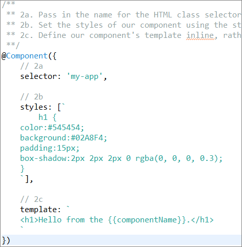
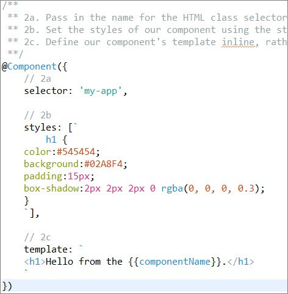

# TM4E Plugin Developer Guide

This guide is for Eclipse plugin developers who want to add TextMate-based syntax highlighting and language configuration features to their editors.
It explains the main TM4E concepts, how to contribute grammars and themes, how to connect editors to TM4E, and how to use the TM partitioner and language configuration support.


## Table of contents

1. [Core Concepts](#core-concepts)
1. [Contributing Grammars](#contributing-grammars)
   1. [External Grammar Injection](#external-grammar-injection)
1. [Contributing Language Configurations](#contributing-language-configurations)
1. [Contributing Themes](#contributing-themes)
1. [Wiring Editors to TM4E](#wiring-editors-to-tm4e)
   1. [Using `TextEditor`](#using-texteditor)
   1. [Using the Generic Editor](#using-the-generic-editor)
1. [Using the TM Partitioner from Code](#using-the-tm-partitioner-from-code)
1. [Diagnostics: Token and Scope Hover](#diagnostics-token-and-scope-hover)
1. [Samples and Tools](#samples-and-tools)
1. [Further Reading](#further-reading)


## Core Concepts

TM4E combines a [TextMate](https://en.wikipedia.org/wiki/TextMate#Language_grammars) grammar engine with Eclipse-specific integration.

A TextMate grammar describes how source code is tokenized into scopes such as `source.ts` or `text.html`.
The TM4E grammar registry maps these scopes to Eclipse content types so that a given file type can be colored by a specific grammar.
Language configuration JSON files add structural editor behavior on top of tokenization, such as bracket handling, on-enter indentation, and comment toggling.

Finally, a TM-specific document partitioner runs as a secondary partitioner.
It exposes the normalized language scope for each region of a document, so that features like content assist or hovers can react to the active embedded language.


## Contributing Grammars

Grammars are contributed through the `org.eclipse.tm4e.registry.grammars` extension point. TM4E supports the common TextMate formats:
- [Property list (XML)](https://en.wikipedia.org/wiki/Property_list) grammars (`*.tmLanguage`, `*.plist`)
- JSON grammars (`*.tmLanguage.json` or VS Code style)
- YAML grammars (for example `*.tmLanguage.yaml` or `*.tmLanguage.yml`) that follow the same TextMate schema and are typically converted by tooling into the in-memory structure that TM4E consumes.

A typical contribution defines a grammar and binds it to a content type:

```xml
<extension point="org.eclipse.tm4e.registry.grammars">
  <grammar
      scopeName="source.json"
      path="syntaxes/JSON.tmLanguage"/>
  <scopeNameContentTypeBinding
      contentTypeId="org.eclipse.languageserver.languages.json"
      scopeName="source.json"/>
</extension>
```

### External Grammar Injection

You can inject additional scopes into an existing grammar. This is useful when one language contains code written in other languages, such as HTML or CSS inside TypeScript decorators.
One plugin can provide the base TypeScript grammar, and another plugin can declare injections that add new scopes without modifying the original grammar file.
The injection is applied at runtime and does not change the original grammar file on disk.

```xml
<extension point="org.eclipse.tm4e.registry.grammars">
  <grammar
      scopeName="source.ts"
      path="syntaxes/TypeScript.tmLanguage.json"/>
</extension>

<extension point="org.eclipse.tm4e.registry.grammars">
  <injection scopeName="template.ng" injectTo="source.ts"/>
  <injection scopeName="styles.ng" injectTo="source.ts"/>
</extension>
```

The injected scopes can then be associated with their own grammars and themes, resulting in proper colorization of HTML and CSS regions inside TypeScript files.

The screenshots below show the effect before and after enabling these injections:

 


## Contributing Language Configurations

Language configuration describes editor behavior beyond pure tokenization. TM4E consumes VS Code style `language-configuration.json` files and exposes them through the `org.eclipse.tm4e.languageconfiguration` bundle.

### 1) Contributing a language-configuration file

As a plug-in author you normally contribute a JSON configuration file with the `org.eclipse.tm4e.languageconfiguration.languageConfigurations` extension point:

```xml
<extension point="org.eclipse.tm4e.languageconfiguration.languageConfigurations">
  <languageConfiguration
      contentTypeId="org.eclipse.corrosion.rust"
      path="language-configurations/language-configuration.json"/>
</extension>
```

The `contentTypeId` in the example refers to the Rust editor from the Corrosion project. Replace it with the content type for your own language so that TM4E can apply the configuration to the correct files. The `path` is resolved relative to your plug-in and the JSON file must be listed in `build.properties`.

The configuration file can contain sections such as `comments`, `brackets`, `autoClosingPairs`, `surroundingPairs`, `folding`, `wordPattern`, and `onEnterRules`. When both the configuration and the current implementation support a feature, TM4E enables:

- auto closing and surrounding pairs
- matching bracket highlighting
- on-enter indentation and comment continuation
- toggle line/block comments
- folding

### 2) JSON format and compatibility with VS Code

TM4E reads `language-configuration.json` files in the same way as VS Code, with the following points to keep in mind:

- `onEnterRules` are declared in the JSON file.
- Regular expressions are provided as JSON strings, so backslashes must be escaped just as in VS Code.
- Indent actions are expressed as string values (for example `"Indent"`, `"Outdent"`, `"IndentOutdent"`, or `"none"`), which TM4E maps internally to the corresponding indentation behavior.

The recommended way to define language configuration is always via JSON `language-configuration.json` files, either contributed through the `languageConfigurations` extension point or added by users in the preferences. Directly implementing TM4E's internal language-configuration interfaces in Java is not required for typical plug-ins and is not considered a stable API surface.

### 3) How TM4E uses language configuration at runtime

Users can attach additional configuration files or disable specific features through the `TextMate > Language Configuration` preference page; this guide focuses on the plug-in-side extension mechanism.

For editors based on the Generic Editor, TM4E contributes:

- auto edit strategies that drive on-enter indentation and auto closing/surrounding pairs based on the configuration
- character pair matchers that implement matching bracket highlighting
- folding reconcilers that use language configuration for region folding

Custom `TextEditor`-based editors can reuse the same TM4E strategies and matchers by installing them in their own `SourceViewerConfiguration` if they want consistent behavior.

TM4E also defines commands for toggling line comments and adding or removing block comments that respect the active language configuration. These commands are bound to standard text editor key bindings where applicable and can be invoked from the IDE's key bindings and command framework.


## Contributing Themes

TM4E ships with built-in Light and Dark themes that are linked to the Eclipse appearance themes, but plugins can contribute additional CSS-based themes through the `org.eclipse.tm4e.ui.themes` extension point.

```xml
<extension point="org.eclipse.tm4e.ui.themes">
  <theme
      id="com.example.MyTheme"
      name="MyTheme"
      path="themes/MyTheme.css"/>
</extension>
```

Themes can be flagged as more suitable for light or dark appearances and can be associated with specific grammar scopes so that, for example, a dedicated theme applies whenever a particular language is active.
You declare one or more `<theme>` elements and then add `themeAssociation` elements that link themes to one or more scopes and optional dark/light variants.
The exact attributes and options are described in the `themes` extension point schema.

At runtime you can also force a specific theme for an editor by calling `setThemeId` on the presentation reconciler:

```java
var r = new org.eclipse.tm4e.ui.text.TMPresentationReconciler();
r.setThemeId(org.eclipse.tm4e.ui.themes.ThemeIdConstants.Monokai);
```


## Wiring Editors to TM4E

Editors must be explicitly wired to TM4E so that tokenization and presentation updates are driven by the TextMate engine.
In Eclipse terms this means:
- using `TMPresentationReconciler` as the presentation reconciler for the editor, and
- ensuring the editor's content type is mapped to a TextMate grammar via TM4E's grammar registry.

The two most common cases are `TextEditor`-based editors and editors built on the Generic Editor.

### Using `TextEditor`

For a `TextEditor`-based editor, install `TMPresentationReconciler` in your `SourceViewerConfiguration` and bind the editor to the relevant content type in `plugin.xml`.

```java
public class MyViewerConfiguration extends SourceViewerConfiguration {
  @Override
  public IPresentationReconciler getPresentationReconciler(ISourceViewer viewer) {
    return new org.eclipse.tm4e.ui.text.TMPresentationReconciler();
  }
}
```

In your editor class, set this viewer configuration in the constructor.
In `plugin.xml`, declare the editor and ensure that its file extensions map to a content type that is bound to a TextMate grammar (via `scopeNameContentTypeBinding` as shown earlier).
The `org.eclipse.tm4e.samples` project contains working examples of this wiring for HTML, TypeScript, and other languages.

### Using the Generic Editor

When using the Eclipse Generic Editor, you connect TM4E by contributing a presentation reconciler:

```xml
<extension point="org.eclipse.ui.genericeditor.presentationReconcilers">
  <presentationReconciler
      class="org.eclipse.tm4e.ui.text.TMPresentationReconciler"
      contentType="org.eclipse.core.runtime.text"/>
</extension>
```

You can target a more specific content type instead of `org.eclipse.core.runtime.text` when you want TM4E highlighting to apply only to particular file types.
The `org.eclipse.core.runtime.text` content type is a generic default for text files; plug-ins should replace it with their own content type ID when they have one.

### Putting it all together: minimal Generic Editor wiring

For a new language with its own file extension, a minimal `plugin.xml` wiring that avoids "no grammar found" issues typically looks like this:

```xml
<!-- 1) Define a content type for your language and its file extension -->
<extension point="org.eclipse.core.contenttype.contentTypes">
  <content-type
      id="com.example.mylang"
      base-type="org.eclipse.core.runtime.text"
      file-extensions="mylang"
      name="MyLang source"/>
</extension>

<!-- 2) Contribute a TextMate grammar and bind it to that content type -->
<extension point="org.eclipse.tm4e.registry.grammars">
  <grammar
      scopeName="source.mylang"
      path="syntaxes/MyLang.tmLanguage.json"/>
  <scopeNameContentTypeBinding
      contentTypeId="com.example.mylang"
      scopeName="source.mylang"/>
</extension>

<!-- 3) Enable the Generic Editor for this content type -->
<extension point="org.eclipse.ui.genericeditor.contentTypes">
  <contentType
      contentType="com.example.mylang"
      editorId="org.eclipse.ui.genericeditor.GenericEditor"/>
</extension>

<!-- 4) Plug TM4E into the Generic Editor for this content type -->
<extension point="org.eclipse.ui.genericeditor.presentationReconcilers">
  <presentationReconciler
      class="org.eclipse.tm4e.ui.text.TMPresentationReconciler"
      contentType="com.example.mylang"/>
</extension>
```

The grammar file `syntaxes/MyLang.tmLanguage.json` must be packaged in your plug-in and listed in `build.properties`. With this setup, opening a `.mylang` file in the Generic Editor will cause TM4E to resolve the `com.example.mylang` content type, load the `source.mylang` grammar, and drive TextMate-based highlighting for that editor.


## Using the TM Partitioner from Code

In addition to the editor's primary partitioner, TM4E installs a secondary partitioner that tracks which language scope is active for each region of a document.
This partitioner uses the ID `tm4e.partitioning`. The base partition type is derived from the root scope of the active grammar and looks like `tm4e:source.js` or `tm4e:text.html`.
Before a grammar is known, a synthetic `tm4e:base` type is used.

For documents with the `org.eclipse.core.runtime.text` base content type, TM4E installs this secondary partitioner automatically via a document setup participant.
Custom editors that use other content types can either reuse this setup or install the TM4E partitioner themselves in their own document setup logic.

Partitions implement `ITMPartitionRegion`, which extends `ITypedRegion` and provides `getGrammarScope()` to expose the normalized scope name for the region.
This makes it easy for features such as content assist, hovers, or folding implementations to react to the embedded language at the caret position.

To access the TM4E partitioner from feature code, query it via `IDocumentExtension3`:

```java
var ext3 = (IDocumentExtension3) doc;
var partitioner = ext3.getDocumentPartitioner(org.eclipse.tm4e.ui.text.TMPartitions.TM_PARTITIONING);
ITypedRegion[] regions = partitioner.computePartitioning(offset, length);
```

For many use cases you only need the partition at the caret offset and the normalized grammar scope:

```java
if (doc instanceof IDocumentExtension3 ext3) {
  var p = ext3.getDocumentPartitioner(org.eclipse.tm4e.ui.text.TMPartitions.TM_PARTITIONING);
  if (p instanceof org.eclipse.tm4e.ui.text.ITMPartitioner tm) {
    var r = tm.getPartition(caretOffset);
    var scope = ((org.eclipse.tm4e.ui.text.ITMPartitionRegion) r).getGrammarScope();
    switch (scope) {
      case "source.js":
        // JavaScript behavior
        break;
      case "source.css":
        // CSS behavior
        break;
      default:
        break;
    }
  }
}
```

If your feature uses `IContentType` rather than scopes, `TMPartitions.getContentTypesForOffset(doc, offset)` translates the TM partition at a given offset into one or more content types.
Convenience methods such as `TMPartitions.hasPartitioning(doc)` and `TMPartitions.getPartition(doc, offset)` help detect whether TM4E is active and retrieve the current region.
Generic Editor extension points still refer to the editor's primary partitioning via their `partitionType` attribute; you always query TM4E's secondary partitioner from code instead of configuring it directly in the extension XML.


## Diagnostics: Token and Scope Hover

When debugging grammars, themes, or partitioning, it is often helpful to see exactly which TextMate token and scopes TM4E has computed at a given location in the editor.

TM4E provides a token hover (implemented as `org.eclipse.tm4e.ui.internal.hover.TMTokenTextHover`) that is contributed to the Generic Editor.
When the hover is enabled, hovering over a token shows:

- The token text with whitespace made visible.
- The token type and origin grammar scope.
- The full list of TextMate scopes applied to the token.
- The JFace text partition information at the caret (offset, length, type) and the TM4E grammar scope for that region.


You can enable or disable this hover on the main `TextMate` preference page (`Window > Preferences > TextMate`) by toggling the "Show TextMate token info hover" checkbox.
This preference applies to editors that use the Generic Editor framework and have TM4E enabled.
The hover is primarily intended for plugin and grammar authors as a troubleshooting tool rather than as an end-user feature.


## Samples and Tools

The `org.eclipse.tm4e.samples` project in this repository contains working examples of grammars, language configurations, editors, and extension point contributions.
It is the best starting point if you want to copy a minimal setup and adapt it to your own language.

In addition, the TM4E UI plug-in contributes several preference pages under `Window > Preferences > TextMate`.
These pages let you inspect and configure grammars, themes, task tags, and language configuration behavior while developing your plug-in.

For interactive grammar development there is also a separate [Previewer](https://marketplace.eclipse.org/content/previewer) plugin that provides a view showing live syntax highlighting for the grammar file you are editing.
Combined with TM4E this allows you to iterate quickly on grammars and themes while validating the scopes that the tokenizer produces.


## Further Reading

For a tutorial-style introduction to implementing TM4E-powered editors and understanding how TextMate grammars and language-configuration files fit together, see:

- The Eclipse newsletter article "TM4E" (June 2018): https://www.eclipse.org/community/eclipse_newsletter/2018/june/tm4e.php
- The Vogella tutorial "Implementing syntax highlighting using TextMate": https://www.vogella.com/tutorials/EclipseEditors/article.html#exercise-implementing-syntax-highlighting-using-text-mate

These external resources complement this guide with end-to-end examples of wiring editors, grammars, and configuration files.

For general Eclipse plug-in development background, including how plug-ins, features, update sites, and IDE extensions fit together, see:

- Vogella's "Eclipse IDE Plug-in Development: Plug-ins, Features, Update Sites and IDE Extensions": https://www.vogella.com/tutorials/EclipsePlugin/article.html
- The Eclipse Platform UI "Eclipse Corner" guide: https://github.com/eclipse-platform/eclipse.platform.ui/blob/master/docs/Eclipse_Corner.md
- The Eclipse Platform UI "Eclipse Plug-in Development FAQ": https://github.com/eclipse-platform/eclipse.platform.ui/blob/master/docs/EclipsePluginDevelopmentFAQ.md
