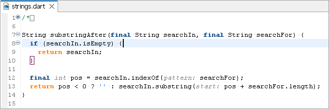
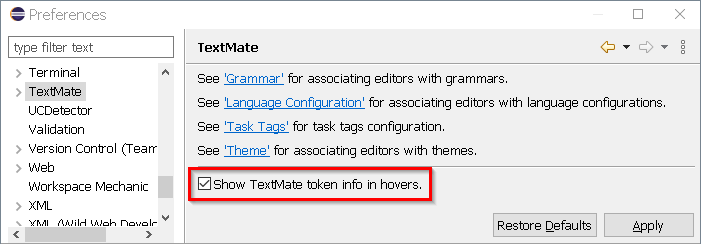
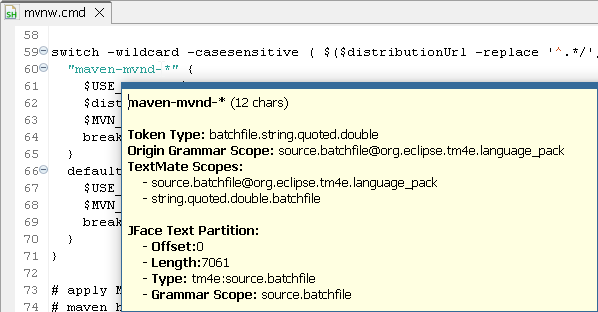
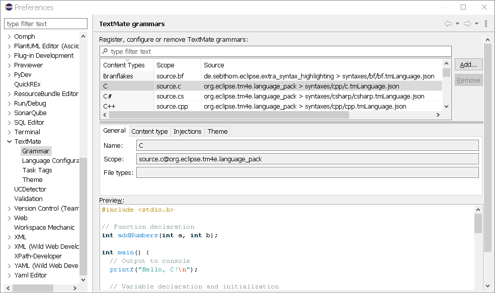
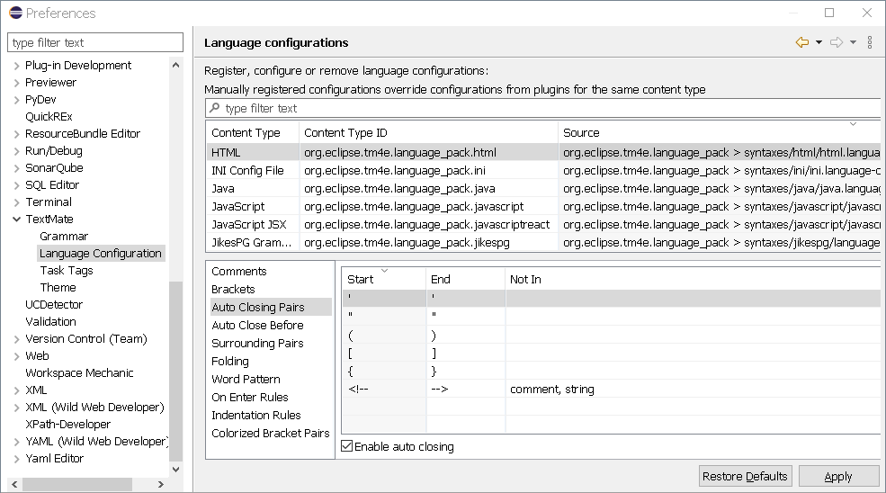
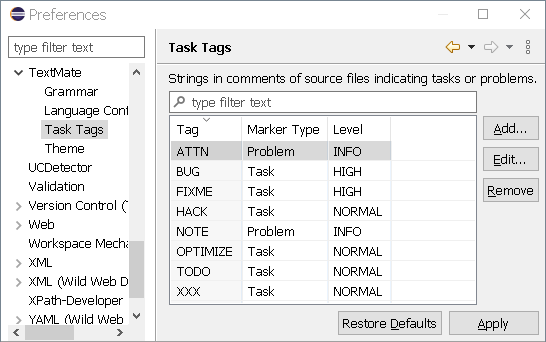
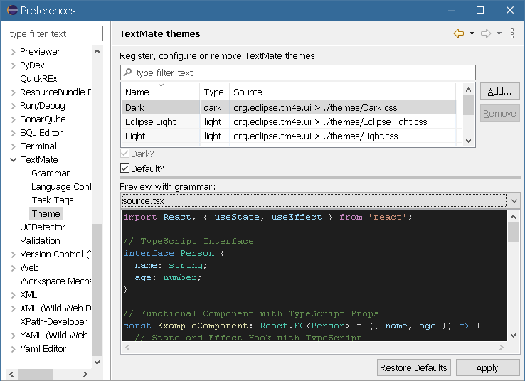

# TM4E User Guide

This guide is for Eclipse users who work with editors powered by TM4E. It explains what TM4E does in the UI, how to install and configure it, and how to troubleshoot common problems.

## Table of contents

1. [Getting TM4E in Eclipse](#getting-tm4e-in-eclipse)
1. [What TM4E Provides in the UI](#what-tm4e-provides-in-the-ui)
1. [Language Pack and Additional Grammars](#language-pack-and-additional-grammars)
1. [Configuring TM4E](#configuring-tm4e)
1. [Using Custom Grammars, Language Configurations, and Themes](#using-custom-grammars-language-configurations-and-themes)
1. [Troubleshooting for End Users](#troubleshooting-for-end-users)
1. [Further Reading](#further-reading)

## Getting TM4E in Eclipse

In most Eclipse installations TM4E is installed automatically as a dependency of language tooling (for example, Wild Web Developer or other language-specific features).
You usually do not need to install it explicitly, but you can install it from the TM4E release update site if necessary.

To check whether TM4E is present, open `Window > Preferences` and look for the `TextMate` pages (such as `TextMate`, `TextMate > Grammar`, `TextMate > Themes`, and `TextMate > Language Configuration`).
If these pages exist, TM4E is installed and contributing to the IDE.

### Stable and snapshot builds

TM4E offers both **stable** and **snapshot** builds.
Stable builds are published on the [releases update site](https://download.eclipse.org/tm4e/releases/latest/) and are recommended for daily use.
Snapshot builds are published on the [snapshots update site](https://download.eclipse.org/tm4e/snapshots/) and are intended for testing upcoming changes.

## What TM4E Provides in the UI

TM4E brings [TextMate](https://en.wikipedia.org/wiki/TextMate#Language_grammars)-based syntax highlighting and a set of language-configuration driven editor features to Eclipse.

### 1) Syntax highlighting

For supported file types, TM4E uses TextMate grammars (files that describe how to tokenize a language) to identify tokens and scopes and then applies colors using the active TextMate theme.
This works in both the [Generic Editor](https://help.eclipse.org/latest/topic/org.eclipse.platform.doc.isv/guide/editors_genericeditor.htm) and in custom editors that are wired to TM4E.

Some editors also combine TM4E with language server features; in that case a few behaviors (such as folding or code actions) may come from either TM4E or the language server, depending on configuration.

### 2) Language-configuration based editor behavior

Language-configuration files enable additional editor behavior for a language. These behaviors include:

- auto-closing brackets
- matching bracket highlighting\
  
- on-enter indentation and comment continuation
- toggling line and block comments
- folding (based on indentation and optional folding markers) in editors that use TM4E's folding support

These behaviors are applied on top of whatever the underlying editor already provides.
TM4E can add these behaviors to simple text editors, or refine them when an editor or language server already offers partial support.

### 3) Diagnostic tools (token hover)

For advanced users, some editors expose a TextMate token hover that shows the token scopes and partition information at the caret location.

- This is mainly a diagnostics tool for plugin and grammar developers.
- It can also help you confirm why a particular region is colored or behaves in a certain way.

For details on how to use the token hover and other diagnostics when developing plugins, see the [TM4E Adopter Guide](adopter-guide.md).

## Language Pack and Additional Grammars

The [TM4E Language Pack](https://github.com/eclipse-tm4e/tm4e/blob/main/org.eclipse.tm4e.language_pack/README.md) feature bundles 50+ TextMate grammars and language configurations so that many common languages work out of the box once TM4E is installed.
Individual Eclipse tools may also ship their own grammars that plug into TM4E.

If you need additional grammars beyond what TM4E and its language pack provide, you can install third-party plugins that contribute more grammars or themes.
One example is the [Extra Syntax Highlighting](https://marketplace.eclipse.org/content/extra-syntax-highlighting) plugin, which offers many additional TextMate grammars.
After installing such a plugin you manage the new grammars and themes through the same TextMate preference pages described below.

## Configuring TM4E

Most user-facing configuration lives under the `TextMate` section in the Eclipse preferences (`Window > Preferences`).

1. The main `TextMate` page provides an overview and general switches.
1. `TextMate > Grammar` lets you manage available grammars and their associations to Eclipse content types (the way Eclipse classifies file types).
   Here you can enable or disable grammars and control which grammar applies to a file type.
   For each selected grammar you can also inspect details, adjust the content types it applies to, configure grammar injections, and manage per-grammar theme associations using the built-in preview.\
   

1. `TextMate > Language Configuration` lets you control language-configuration based features and attach additional configuration files:
   - You can enable or disable auto closing brackets, matching bracket highlighting, and on-enter actions individually.
   - You can associate extra `language-configuration.json` files from the workspace or file system with specific content types.

   TM4E consumes VS Code-style [language-configuration.json](https://code.visualstudio.com/api/language-extensions/language-configuration-guide) files.

   

1. `TextMate > Task Tags` lets you define tags in comments (such as `TODO` or `FIXME`) that should be treated as tasks or problems, and configure how they are marked in the workspace.\
   

1. `TextMate > Themes` lets you choose between built-in Light and Dark themes and any additional themes contributed by installed plugins, as well as import extra theme files and set the default theme for light and dark modes.
   You can also switch themes from the editor's context menu under `TextMate`.\
   

## Using Custom Grammars, Language Configurations, and Themes

Beyond the defaults provided by TM4E and its language pack, you can register additional grammars, language-configuration files, and themes through the UI.

To import a TextMate grammar, use the TextMate grammar import wizard or the grammar preferences to point TM4E at a grammar file on disk.
Once imported, you can associate the grammar with one or more content types on the `TextMate > Grammar` page so that it is used for the corresponding file types.

To add an extra language-configuration file, go to `TextMate > Language Configuration` and associate the configuration with the relevant content type.
This is useful if a plugin does not already provide a configuration file for that language or if you want to experiment with your own configuration.

Themes are contributed by plugins and selected on the `TextMate > Themes` page.
Built-in themes cover common Light and Dark appearances, while plugin-provided themes can add alternative color schemes.
You can also use the `New...` button on that page to import additional TextMate theme files from disk and mark one as the default for Light or Dark mode.
If you are interested in authoring themes or grammars yourself, see the Plugin Developer Guide for extension point and authoring details.

## Troubleshooting for End Users

- **Syntax highlighting does not appear**:
  First check that TM4E is installed (the TextMate preference pages should exist).
  Then open `TextMate > Grammar` to verify that a grammar is associated with the file's content type and that it is enabled.

- **Bracket behavior or on-enter actions do not work**:
  Open `TextMate > Language Configuration` and confirm that the corresponding features are enabled.
  It is also useful to check whether another editor or language server is overriding the behavior for that file type.

- **Editor does not appear to use TM4E**:
  Try opening the same file with the Generic Editor.
  If the Generic Editor shows TM4E-based highlighting while a custom editor does not, the custom editor may not be wired to TM4E or may rely solely on its own partitioning or language server integration.

- **Collecting diagnostics for bug reports**:
  To capture text events and generate a Java test skeleton, add `org.eclipse.tm4e.ui/debug/log/GenerateTest=true` to a debug options file (usually named `debug.options`) and start Eclipse with `-debug /path/to/debug.options`; the test skeleton is written to the error output stream when you close an editor that uses TM4E.
  If you need TM4E to fail fast when no grammar is found for a document (for example when isolating a bug), you can additionally set `org.eclipse.tm4e.ui/debug/log/ThrowError=true`, which causes an exception to be thrown instead of silently disabling TM4E for that document.

## Further Reading

For additional background on what TM4E provides in Eclipse and how it fits into the IDE, see the Eclipse newsletter article "TM4E" (June 2018): https://www.eclipse.org/community/eclipse_newsletter/2018/june/tm4e.php

If you plan to implement your own TM4E-based editor or customize integration at the plugin level, switch to the [TM4E Adopter Guide](adopter-guide.md), which is targeted specifically at plugin adopters and plug-in authors.
