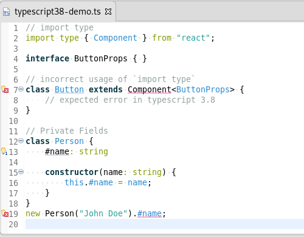
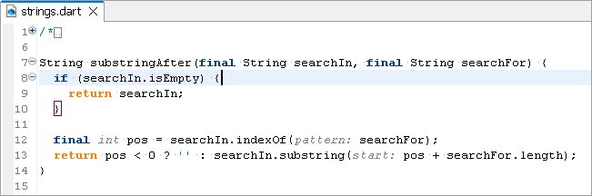
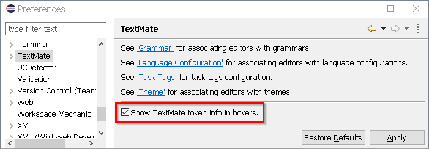
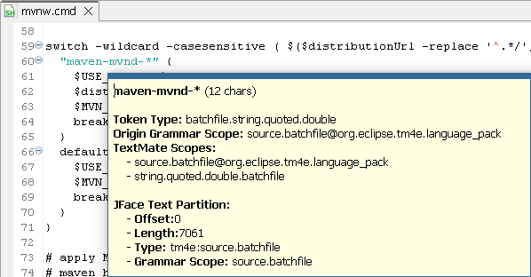
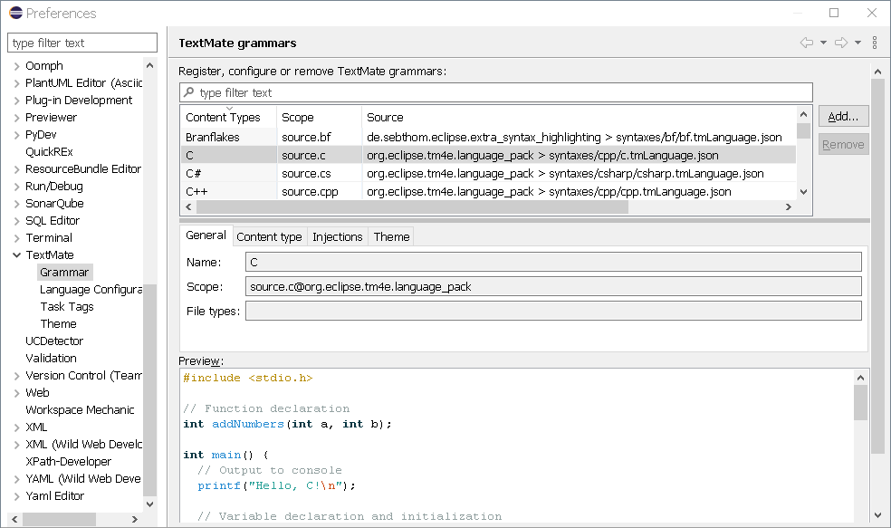
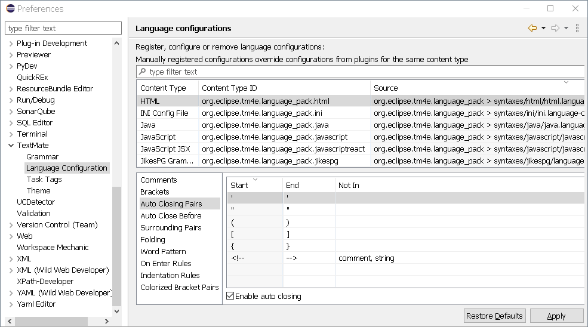
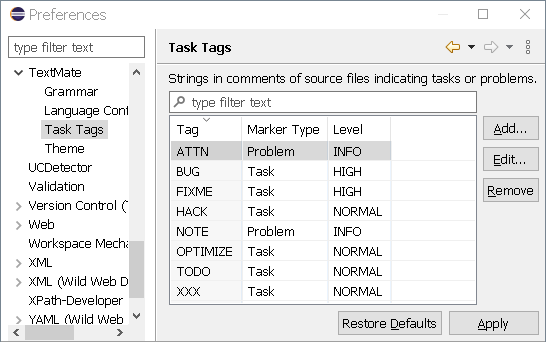
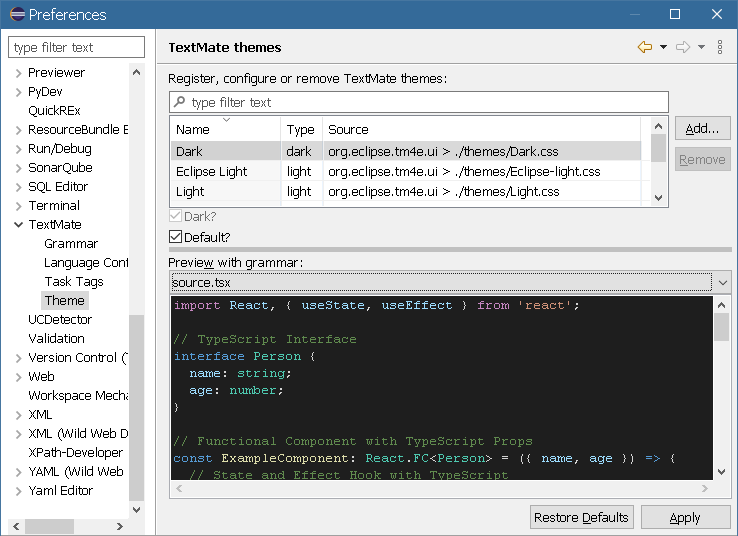
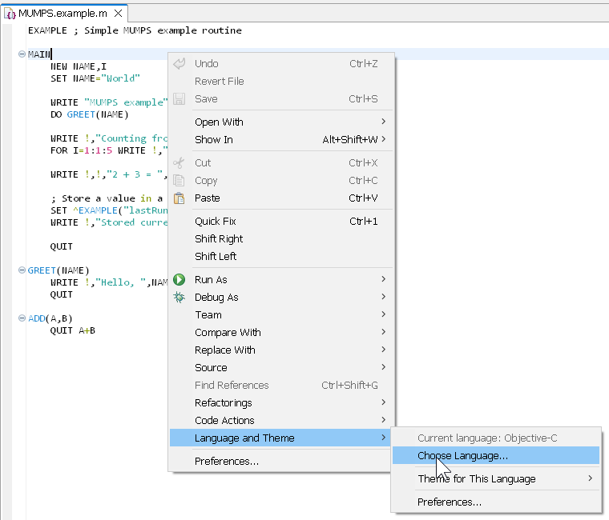

# TM4E User Guide

This guide is for Eclipse users who work with editors powered by TM4E. It explains what TM4E does in the UI, how to install and configure it, and how to troubleshoot common problems.

## Table of contents

1. [Getting TM4E in Eclipse](#getting-tm4e-in-eclipse)
1. [What TM4E Provides in the UI](#what-tm4e-provides-in-the-ui)
1. [Language Pack and Additional Grammars](#language-pack-and-additional-grammars)
1. [Configuring TM4E](#configuring-tm4e)
1. [Using Custom Grammars, Language Configurations, and Themes](#using-custom-grammars-language-configurations-and-themes)
   1. [Using a custom grammar as the workspace default](#using-a-custom-grammar-as-the-workspace-default)
   1. [Choosing a language for one file](#choosing-a-language-for-one-file)
   1. [Adding editing rules for a language](#adding-editing-rules-for-a-language)
   1. [Importing and choosing themes](#importing-and-choosing-themes)
   1. [How TM4E chooses between workspace bindings](#how-tm4e-chooses-between-workspace-bindings)
1. [Troubleshooting for End Users](#troubleshooting-for-end-users)
1. [Further Reading](#further-reading)

## Getting TM4E in Eclipse

In most Eclipse installations TM4E is installed automatically as a dependency of language tooling (for example, Wild Web Developer or other language-specific features).
You usually do not need to install it explicitly, but you can install it from the TM4E release update site if necessary.

To check whether TM4E is present, choose `Window > Preferences` from Eclipse's main menu.
In the preferences dialog, look for the `TextMate` pages, such as `Grammar`, `Theme`, and `Language Configuration`.
If these pages exist, TM4E is installed and contributing to the IDE.

### Stable and snapshot builds

TM4E offers both **stable** and **snapshot** builds.
Stable builds are published on the [releases update site](https://download.eclipse.org/tm4e/releases/latest/) and are recommended for daily use.
Snapshot builds are published on the [snapshots update site](https://download.eclipse.org/tm4e/snapshots/) and are intended for testing upcoming changes.

## What TM4E Provides in the UI

TM4E brings [TextMate](https://en.wikipedia.org/wiki/TextMate#Language_grammars)-based syntax highlighting and a set of language-configuration driven editor features to Eclipse.

### 1) Syntax highlighting

For supported file types, TM4E uses TextMate grammars (files that describe how to tokenize a language) to identify tokens and scopes and then applies colors using the active TextMate theme.
This works in both the [Generic Editor](https://help.eclipse.org/latest/topic/org.eclipse.platform.doc.isv/guide/editors_genericeditor.htm) and in custom editors that are wired to TM4E.

Some editors also combine TM4E with language server features; in that case a few behaviors (such as folding or code actions) may come from either TM4E or the language server, depending on configuration.

### 2) Language-configuration based editor behavior

Language-configuration files enable additional editor behavior for a language. These behaviors include:

- auto-closing brackets
- matching bracket highlighting\
  
- on-enter indentation and comment continuation
- toggling line and block comments
- folding (based on indentation and optional folding markers) in editors that use TM4E's folding support

These behaviors are applied on top of whatever the underlying editor already provides.
TM4E can add these behaviors to simple text editors, or refine them when an editor or language server already offers partial support.

### 3) Custom code templates and code proposals

TM4E offers support for defining and proposing custom code templates for the languages available through a TextMate grammar.
To configure templates, open `Window > Preferences > TextMate > Templates` in Eclipse.

Each template is registered to a context type, i.e. a language or grammar (technically a TextMate scope).
In addition to available grammars, TM4E offers two special context types for comments.
Templates registered for these context types can be used in all languages having such comments in their grammar.

For example, users can register custom C/C++ or JavaScript statements, but also generally usable comment texts like a Copyright notice, a license, or a TODO comment with the user's name.
Having a TM4E-based editor open, they'll get that code snippets suggested via code completion triggered by Ctrl + Space.

The two generic context types for comments are:

- Comment (any comment that is not a documentation comment, i.e. line comments and standard block comments like code between `/*` and `*/` in Java / C++)
- Documentation comment (a comment that is used for code documentation, e.g. javadoc comments in Java, i.e. code between `/**` and `*/`)

### 4) Diagnostic tools (token hover)

For advanced users, some editors expose a TextMate token hover that shows the token scopes and partition information at the caret location.

- This is mainly a diagnostics tool for plugin and grammar developers.
- It can also help you confirm why a particular region is colored or behaves in a certain way.

For details on how to use the token hover and other diagnostics when developing plugins, see the [TM4E Adopter Guide](adopter-guide.md).

## Language Pack and Additional Grammars

The [TM4E Language Pack](https://github.com/eclipse-tm4e/tm4e/blob/main/org.eclipse.tm4e.language_pack/README.md) feature bundles 50+ TextMate grammars and language configurations so that many common languages work out of the box once TM4E is installed.
Individual Eclipse tools may also ship their own grammars that plug into TM4E.

If you need additional grammars beyond what TM4E and its language pack provide, you can install third-party plugins that contribute more grammars or themes.
One example is the [Extra Syntax Highlighting](https://marketplace.eclipse.org/content/extra-syntax-highlighting) plugin, which offers many additional TextMate grammars.
After installing such a plugin you manage the new grammars and themes through the same TextMate preference pages described below.

## Configuring TM4E

Choose `Window > Preferences` from Eclipse's main menu to open the preferences dialog.
Expand `TextMate` to find the following pages:

1. The main `TextMate` page provides an overview and general switches.
1. `Grammar` lets you import and remove grammars
   and assign them to Eclipse content types (the way Eclipse classifies files).
   For each grammar, you can also view its details and injections, choose a theme, and preview the result.\
   

1. `Language Configuration` lets you configure editing features
   and add language-configuration files:
   - You can enable or disable auto closing brackets, matching bracket highlighting, and on-enter actions individually.
   - You can associate extra `language-configuration.json` files from the workspace or file system with specific content types.

   TM4E consumes VS Code-style [language-configuration.json](https://code.visualstudio.com/api/language-extensions/language-configuration-guide) files.

   

1. `Task Tags` lets you define tags in comments (such as `TODO` or `FIXME`)
   that should be treated as tasks or problems, and configure how they are marked in the workspace.\
   

1. `Templates` lets you specify custom code templates for available TextMate grammars (languages).
   These will be used in code proposals triggered by Ctrl + Space.\
   

1. `Theme` lets you choose a built-in theme or one provided by a plugin.
   You can also import theme files and set the default theme for light and dark modes.
   To switch themes from an editor, use its context menu:
   `Language and Theme > Theme for This Language`.

   

## Using Custom Grammars, Language Configurations, and Themes

You can add grammars for syntax highlighting, language configurations for editing rules, and themes for colors.
Open Eclipse's preferences dialog by choosing `Window > Preferences` from the main menu.

New grammars are imported without setting a workspace default.
Choose whether to set a workspace default explicitly or select the imported language for one file:

| Choice | Affects | When it takes effect |
| --- | --- | --- |
| Workspace default | Matching files without their own language choice | After reopening the editors |
| Language for one file | One workspace file and all its open editors | Immediately |

A file's saved language choice takes priority over the workspace default.

### Using a custom grammar as the workspace default

A **content type** tells Eclipse which files belong to a language.
A **binding** tells TM4E which grammar to use for that content type.
When you set a workspace default, TM4E creates them when needed.

1. In Eclipse, open `Window > Preferences > TextMate > Grammar`.
1. Click `Add...` and choose a grammar file from disk.
1. Review `Matching files`, for example `*.m`, `Makefile`, or `*.spec.rb`.
   Separate entries with commas.
1. Select `Set this grammar as the workspace default for matching files`.
1. Click `Finish`, then click `Apply and Close`.
   Reopen the affected editors.

TM4E creates a content type under `Text > TM4E Syntax Highlighting` and binds the imported grammar to it.
You do not need to create either one manually.

You can also use `File > Import... > TextMate > TextMate grammar` from the main menu.
That wizard saves the setup when you click `Finish`.

The grammar supplies the initial entries in `Matching files`.
Check them, as the grammar may use different extensions from your files.
Use `*.ext` patterns or exact file names, for example `*.m`, `Makefile`, or `*.spec.rb`.
Paths and other wildcard patterns are not supported.

To import without setting a workspace default, leave the checkbox unchecked.
This keeps existing workspace defaults when you import the same grammar again.
You can also clear `Matching files` if you do not want filename-based suggestions for this grammar.

Each content type can have one selected grammar.
For matching files without their own language choice, this grammar overrides the grammar provided by a plugin.
If the content type already uses another grammar, TM4E asks whether to replace it.
If another imported file has the same value in the `Scope` column, remove that import before binding the new grammar.

**To restore automatic selection:** Select the grammar and open its `Content type` tab.
Select the binding, click `Remove`, and then click `Apply and Close`.
Reopen the affected editors.

#### Existing imports and content types

Existing workspaces keep their imports and settings.
To enable automatic setup for an older import, import the same file again and select the workspace-default checkbox.
TM4E reuses the import and any setup it previously created.
It does not take ownership of content types you created manually.
When you import the same grammar again, leave the workspace-default checkbox unchecked to keep its current content type and bindings.

To bind a grammar to an existing content type, select the grammar in the preferences page,
open its `Content type` tab, and click `Add...`.
Repeat this step for additional content types.
Click `Apply and Close`, then reopen affected editors.

#### Example: suggest Mumps for `.m` files

The TM4E Language Pack associates `.m` files with Objective-C.
Mumps uses the same extension, so Mumps files may receive Objective-C highlighting.
The steps below keep Objective-C as the automatic language and make Mumps easy to choose for individual `.m` files.

1. Download a [Mumps grammar](https://raw.githubusercontent.com/ksherlock/MUMPS.tmbundle/refs/heads/master/Syntaxes/mumps.tmLanguage).
1. Open `Window > Preferences > TextMate > Grammar`, click `Add...`, and select the downloaded file.
1. Set `Matching files` to `*.m` and leave the workspace-default checkbox unchecked.
   This grammar declares only the `.int` file extension, so its initial suggestions do not include `.m`.
   Include `*.int` too if you use that extension.
1. Click `Finish`, then click `Apply and Close`.

Opening an `.m` file still selects Objective-C automatically.
Open `Choose Language...` to see Mumps and Objective-C before languages that do not match `.m`.
Choose Mumps for files that need it.

These steps add syntax highlighting for Mumps.
To add features such as automatic indentation and bracket completion, see
[Adding editing rules for a language](#adding-editing-rules-for-a-language).

#### Removing an import or restoring a missing file

- **Remove an import:** Under `Window > Preferences > TextMate > Grammar`, select the import and click `Remove`.
  Then click `Apply and Close`.
  TM4E also removes its bindings unless another import provides the same scope.
  The content type and file associations remain because editing rules or saved file choices may still use them.
  You can remove unused content types under `Window > Preferences > General > Content Types`.
- **Grammar file missing:** The grammar list marks its source as `file unavailable`.
  TM4E keeps the settings and falls back to the usual grammar selection.
  Restore the file at the same path and reopen affected editors to use it again.

If you change an automatically created type in `General > Content Types`, TM4E preserves those changes.
Continue managing that type there, or import the grammar again and leave the workspace-default checkbox unchecked.

### Choosing a language for one file

Use a file-specific choice when files with the same extension need different languages.
For example, `routine.m` can use Mumps while `AppDelegate.m` uses Objective-C.

**Before you start:** Eclipse must recognize the file as text to load TM4E's editor features.
Setting an imported grammar as the workspace default creates this setup for its matching files.
If you need to set it up manually, open `Window > Preferences > General > Content Types` and create a child content type
under `Text > TM4E Syntax Highlighting`, then add the required file associations.

1. Open the file in an editor that uses TM4E, such as the Generic Editor.
1. Right-click in the editor and select `Language and Theme > Choose Language...`.

   

1. Choose the language and click `OK`.
   The list includes imported grammars and grammars provided by plugins.
   Languages that match the file name appear first, in alphabetical order.
   You can search by language name; entries also show their TextMate scope to distinguish different providers.

After you choose a language:

- **Immediate update:** All open editors for the file use the new language.
  Your unsaved text, selection, and undo history are preserved.
- **Saved choice:** Eclipse remembers your choice in this workspace, even after a restart.
  It does not change the file contents.
  Later changes to workspace grammar bindings do not replace it.
- **Editing rules:** Both syntax highlighting and editing rules follow the selected language.
  Entries marked `syntax highlighting only` have no associated content type for editing rules,
  so features such as bracket completion, comment toggling, and language-specific indentation are not available.
- **Menu label:** The menu shows the saved language name, for example `Choose Language (Mumps)...`.

**To return to the default:** Select `Language and Theme > Reset Language to Default` in the editor's context menu.
This action appears only when the file has a saved choice.
TM4E immediately returns to the workspace binding or the usual automatic selection.
The same fallback applies if the chosen grammar or content type is no longer installed.

### Adding editing rules for a language

Language-configuration files provide rules for features such as brackets, indentation, comments, and folding.
Add one when a plugin does not provide a configuration for the language, or when you want to use your own rules.

1. In Eclipse, open `Window > Preferences > TextMate > Language Configuration`.
1. Associate the language-configuration file with the language's content type.
   If you added a grammar binding, use the same content type for both.
1. Click `Apply and Close`.

TM4E uses the selected language's content type for both highlighting and editing rules.
If that type has no language configuration, TM4E does not use editing rules from another matching language.

### Importing and choosing themes

The `Window > Preferences > TextMate > Theme` page lets you choose built-in Light and Dark themes
or themes provided by plugins.
To import another theme:

1. In Eclipse, open `Window > Preferences > TextMate > Theme`.
1. Click `Add...` and choose a TextMate theme file from disk.
1. Optionally, mark it as the default for Light or Dark mode.
1. Click `Apply and Close`.

To change the theme for the language currently used by the editor, right-click in the editor and select
`Language and Theme > Theme for This Language`.
The choice applies to that language throughout the workspace.
TM4E keeps separate choices for light and dark Eclipse themes.

### How TM4E chooses between workspace bindings

A binding also applies to content types that inherit from the type you selected.
This matters when more than one binding can match a file.
TM4E then:

1. Checks the content types that Eclipse reports for the file, in the order Eclipse provides them.
1. Checks each content type's own binding first, followed by its parent types, starting with the direct parent.
1. Uses the first binding whose grammar can be loaded.

**Imported grammars with the same scope:** If several imported files have the same value in the `Scope` column,
TM4E uses the first import.
To use another file, remove the earlier imports with that scope before adding its binding.
Different content types cannot select different imported files with the same scope.

To create your own themes or grammars, see the [TM4E Adopter Guide](adopter-guide.md).
It explains the extension points and file formats.

## Troubleshooting for End Users

- **Syntax highlighting does not appear**:
  First check that TM4E is installed (the TextMate preference pages should exist).
  In Eclipse, open `Window > Preferences > TextMate > Grammar`.
  Check that a grammar is associated with the file's content type and that it is enabled.

- **One file uses the wrong language**:
  Open the editor's context menu and check `Language and Theme > Current language: ...`.
  If the menu shows a saved choice such as `Choose Language (Mumps)...`, select
  `Language and Theme > Reset Language to Default` to return to automatic selection.

- **Bracket behavior or on-enter actions do not work**:
  In Eclipse, open `Window > Preferences > TextMate > Language Configuration`.
  Check that the corresponding features are enabled.
  It is also useful to check whether another editor or language server is overriding the behavior for that file type.

- **Editor does not appear to use TM4E**:
  Try opening the same file with the Generic Editor.
  If the Generic Editor shows TM4E-based highlighting while a custom editor does not, the custom editor may not be wired to TM4E or may rely solely on its own partitioning or language server integration.

- **Collecting diagnostics for bug reports**:
  To capture text events and generate a Java test skeleton, add `org.eclipse.tm4e.ui/debug/log/GenerateTest=true` to a debug options file (usually named `debug.options`) and start Eclipse with `-debug /path/to/debug.options`; the test skeleton is written to the error output stream when you close an editor that uses TM4E.
  If you need TM4E to fail fast when no grammar is found for a document (for example when isolating a bug), you can additionally set `org.eclipse.tm4e.ui/debug/log/ThrowError=true`, which causes an exception to be thrown instead of silently disabling TM4E for that document.

## Further Reading

For additional background on what TM4E provides in Eclipse and how it fits into the IDE, see the Eclipse newsletter article "TM4E" (June 2018): https://www.eclipse.org/community/eclipse_newsletter/2018/june/tm4e.php

If you plan to implement your own TM4E-based editor or customize integration at the plugin level, switch to the [TM4E Adopter Guide](adopter-guide.md), which is targeted specifically at plugin adopters and plug-in authors.
